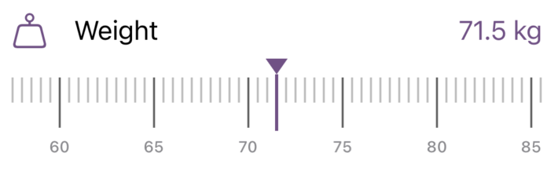
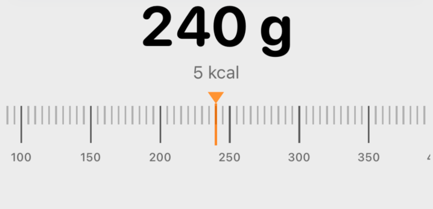

# SwiftHorizontalRuler

[](https://swiftpackageindex.com/unibrix/SwiftHorizontalRuler)
[](https://swiftpackageindex.com/unibrix/SwiftHorizontalRuler)
[](LICENSE)

A configurable horizontal ruler picker for iOS. Built with UIKit for smooth, snappy scrolling — wrapped in SwiftUI for easy integration.

<p align="center">
  
  
</p>

## Features

- Smooth UIKit-backed scrolling with snap-to-tick behavior
- Configurable haptic feedback (selection, impact, or none)
- Fully configurable: range, increments, tick spacing, labels, indicator color
- Works in any SwiftUI layout
- iOS 17+

## Installation

### Swift Package Manager

In Xcode: **File > Add Package Dependencies...** and enter:

```
https://github.com/unibrix/SwiftHorizontalRuler
```

Or add to your `Package.swift`:

```swift
dependencies: [
    .package(url: "https://github.com/unibrix/SwiftHorizontalRuler", from: "1.0.0")
]
```

## Usage

```swift
import SwiftHorizontalRuler
```

### Basic Example

```swift
struct WeightPicker: View {
    @State private var weight: Double = 70

    var body: some View {
        VStack {
            Text("\(Int(weight)) kg")
                .font(.largeTitle.bold())

            HorizontalRuler(
                value: $weight,
                config: HorizontalRulerConfig(
                    minValue: 30,
                    maxValue: 200,
                    minorIncrement: 0.5,
                    majorIncrement: 5,
                    tickSpacing: 6
                )
            )
            .frame(height: 70)
        }
    }
}
```

### Custom Labels

```swift
HorizontalRuler(
    value: $calories,
    config: HorizontalRulerConfig(
        minValue: 0,
        maxValue: 5000,
        minorIncrement: 50,
        majorIncrement: 500,
        tickSpacing: 6,
        labelFormatter: { value in
            value >= 1000 ? String(format: "%.0fk", value / 1000) : String(format: "%.0f", value)
        }
    )
)
.frame(height: 70)
```

### Custom Indicator Color

```swift
HorizontalRuler(
    value: $volume,
    config: HorizontalRulerConfig(
        minValue: 10,
        maxValue: 1000,
        minorIncrement: 10,
        majorIncrement: 50,
        tickSpacing: 7,
        indicatorColor: .systemOrange
    )
)
.frame(height: 70)
```

### Haptic Feedback

Haptics are enabled by default (`.selection` style). You can change the style or disable them:

```swift
// Heavier haptic feedback
HorizontalRuler(
    value: $weight,
    config: HorizontalRulerConfig(
        minValue: 30, maxValue: 200,
        minorIncrement: 0.5, majorIncrement: 5,
        hapticStyle: .medium
    )
)
.frame(height: 70)

// No haptics
HorizontalRuler(
    value: $weight,
    config: HorizontalRulerConfig(
        minValue: 30, maxValue: 200,
        minorIncrement: 0.5, majorIncrement: 5,
        hapticStyle: .none
    )
)
.frame(height: 70)
```

Available styles: `.none`, `.selection` (default), `.light`, `.medium`, `.heavy`

### Reusable Configs via Extensions

Define app-specific presets:

```swift
extension HorizontalRulerConfig {
    static func bodyWeight() -> HorizontalRulerConfig {
        HorizontalRulerConfig(
            minValue: 30, maxValue: 200,
            minorIncrement: 0.5, majorIncrement: 5,
            tickSpacing: 6
        )
    }

    static func drinkVolume() -> HorizontalRulerConfig {
        HorizontalRulerConfig(
            minValue: 10, maxValue: 1000,
            minorIncrement: 10, majorIncrement: 50,
            tickSpacing: 7
        )
    }
}
```

Then use them:

```swift
HorizontalRuler(value: $weight, config: .bodyWeight())
    .frame(height: 70)
```

## Configuration

| Parameter | Type | Default | Description |
|---|---|---|---|
| `minValue` | `Double` | — | Minimum selectable value |
| `maxValue` | `Double` | — | Maximum selectable value |
| `minorIncrement` | `Double` | — | Step between minor ticks |
| `majorIncrement` | `Double` | — | Step between labeled ticks |
| `tickSpacing` | `CGFloat` | `6` | Point spacing between minor ticks |
| `indicatorColor` | `UIColor` | `.tintColor` | Center indicator line/triangle color |
| `hapticStyle` | `RulerHapticStyle` | `.selection` | Haptic feedback on each tick |
| `labelFormatter` | `(Double) -> String` | `"%.0f"` | Formats major tick labels |

## Requirements

- iOS 17+
- Swift 5.9+
- Xcode 15+

## License

MIT License. See [LICENSE](LICENSE) for details.
